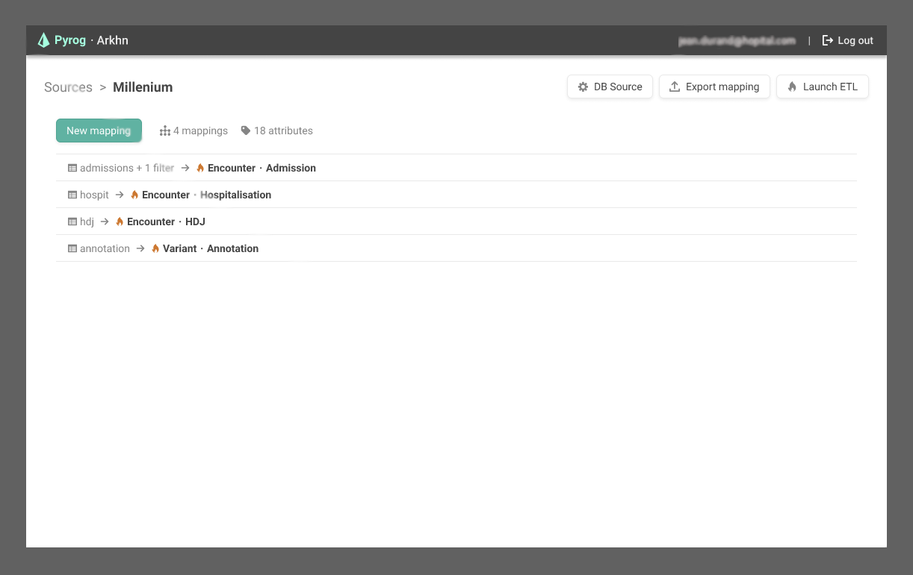

# FHIR River & Pyrog

> Standardize healthcare data to FHIR

Pyrog and River are user-friendly tools that make your data standardization easier and faster

Using **Pyrog**, you can represent the data from any data sources in the FHIR standard.

Using **River** and your Pyrog mappings, you can ETL your data, from a data source to a FHIR data warehouse.

## [Changelog](./CHANGELOG.md)

## [Contributing](./CONTRIBUTING.md)

## [License](./LICENSE)

Distributed under Apache 2.0 License.
