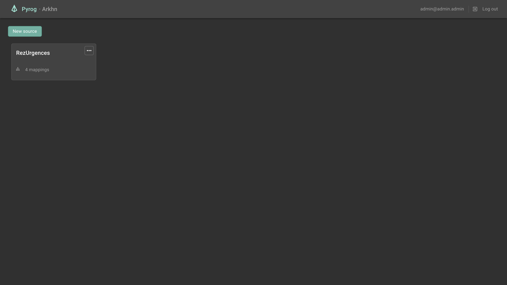
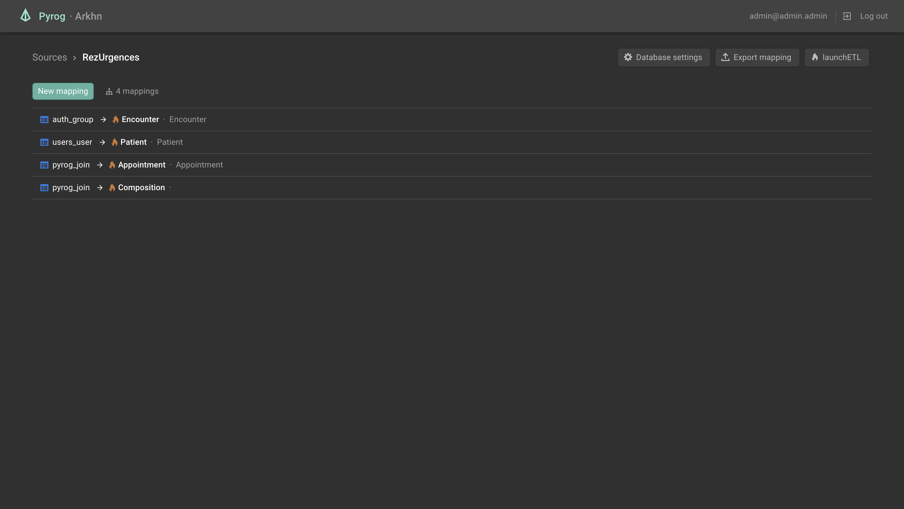
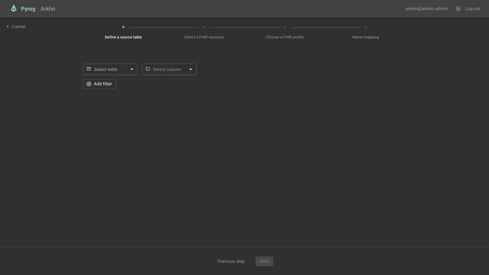
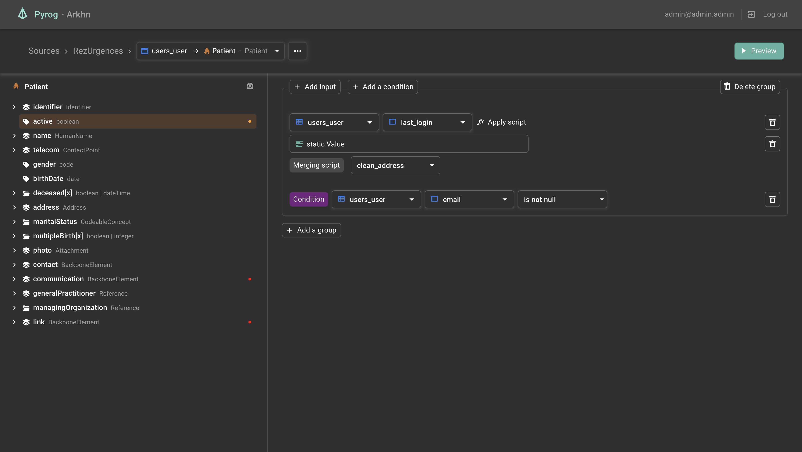
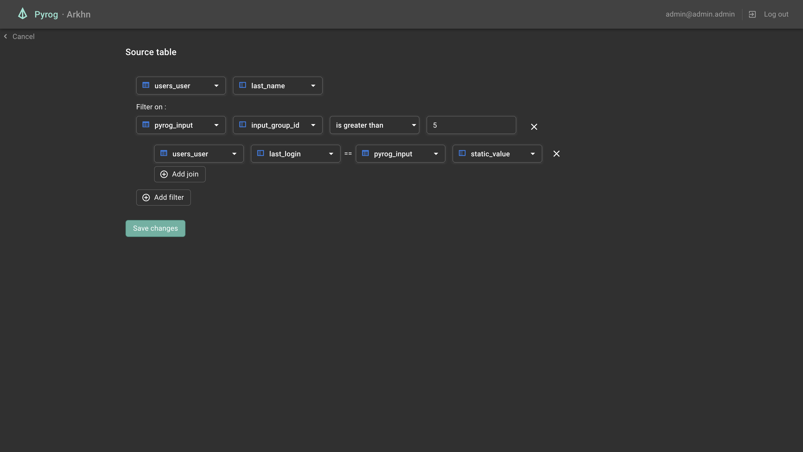
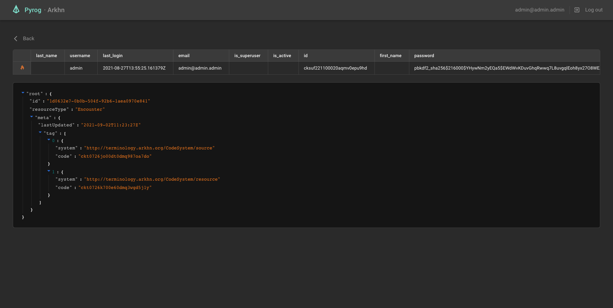

# App
## Generate API Routes
```shell
yarn generate:api
```

## Style guide
This React-Redux project follows the overall [Redux style guide](https://redux.js.org/style-guide/style-guide) recommended patterns

### Structure Files as Feature Folders with Single-File Logic
```
    .
    /src
    ├── index.tsx                       # Entry point file that renders the React component tree
    ├── /app
    │   ├── store.ts                    # store setup
    │   ├── App.tsx                     # root React component
    │   └── /routes                     # router and layout folders
    │       ├── Router.tsx              # Router component
    │       ├── Sources.tsx             # root Page component
    │       └── /resources
    │           └── Resources.tsx
    ├── /common                         # hooks, generic components, utils, etc
    ├── /features                       # contains all "feature folders"
    │   └── /todos                      # a single feature folder
    │       ├── todoSlice.ts            # Redux reducer logic and associated actions
    │       └── Todo.tsx                # a React component
    ├── /locales                        # i18n configuration
    ├── /services                       # contains the external called services
    │   └── /api                        # main api folder
    │       ├── /generated              # contains the generated rtk-query file with hooks (read only)
    │       │   └── api.generated.ts
    │       ├── api.ts                  # contains the enhanced endpoints
    │       └── apiBaseQuery.ts         # contains fetch configuration
```
* `/app` contains app-wide setup and layout that depends on all the other folders.
    * `/routes` contains the router component, and the layout folders which follow the routes tree
* `/common` contains truly generic and reusable utilities and components.
* `/features` has folders that contain all functionality related to a specific feature.
  In this example, todosSlice.ts is a "duck"-style file that contains a call to
  RTK's createSlice() function, and exports the slice reducer and action creators. Those folders
  shouldn't be deeply nested.

### Testing guiding principles
[The more your tests resemble the way your software is used, the more confidence they can give you.](https://testing-library.com/docs/guiding-principles)


# App Dependencies


## [Redux ToolKit](https://redux-toolkit.js.org/)
`Redux ToolKit` is a package used to handle the whole application state. Its module [RTK-Query](https://redux-toolkit.js.org/rtk-query/overview) is also used to handle API calls.
We made the choice of handling the state in 2 different ways : 


### - Using `RTK-Query`'s cached requests responses
The whole API schema is automatically generated by `tox` python module. This allows us to generate all the available API routes with [rtk-query-codegen](https://github.com/rtk-incubator/rtk-query-codegen) and thus it gives us access to a whole load of `Hooks` used to request data. Those hooks are wired to a redux `store` under the hood and the whole cache system is handled by `RTK-Query` itself.

To summarize, all the data displayed in the App comes from those `hooks`.


### - Using local `slices` (`Redux ToolKit`'s store system)
Basically, a `slice` is a store created with `Redux ToolKit`'s API. It handles nicely the actions/thunks/reducers logic.
In this project, when needed, a `slice` is created for each model class in need (ie `columnSlice`, `joinSlice`, ...). Those slices usually expose actions with basic purposes like adding an object or deleting one.

The main reason that made us use those `slices` on top of `RTK-Query`'s API store is to handle back-end objects creations/updates locally before applying the changes in the back-end. The best example use would be the whole mapping editing process : Before applying the changes made, we need to edit locally a whole load of class instances locally (columns, joins, filters, ...). 


## [Material-UI](https://material-ui.com/)

`Material-UI` is a React UI components library that follows the `Material Design` pattern. We use this library for our whole application UI.


## [Blueprint](https://blueprintjs.com/docs/)

`Blueprint` is another React UI components library. In our case, we only use this library for its icons.


## [I18next](https://www.i18next.com/)

`I18next` is an internationalization-framework used to translate our application in several languages. For now, there is only an English translation available.


## [ahryman40k/ts-fhir-types](https://www.npmjs.com/package/@ahryman40k/ts-fhir-types)

This typescript package lets us manage and handle FHIR R4 object models in our application.


# Codebase Logic

## Routes

Routes source code is located in folder `src/routes/`


### Sources


- URL: `/` or `/sources`
- Features:
  - [Sources](#sourcesFeature)


### SourceMappings


- URL: `/sources/:sourceId`
- Features: 
  - [Sources](#sourcesFeature)
  - [Mappings](#mappingsFeature)
  - [NavBar](#navBarFeature)


### Batches


- URL: `/sources/:sourceId/batches`
- Features:
  - [Batches](#batchesFeature)
  - [NavBar](#navBarFeature)


### CreateMapping


- URL: `/sources/:sourceId/batches`
- Features:
  - [Columns](#columnsFeature)
  - [Filters](#filtersFeature)
  - [Joins](#joinsFeature)
  - [Mappings](#mappingsFeature)


### Mapping


- URL: `/sources/:sourceId/mappings/:mappingId`
- Features:
  - [FhirAttributePanel](#fhirAttributePanelFeature)
  - [FhirResourceTree](#fhirResourceTreeFeature)
  - [Conditions](#conditionsFeature)
  - [Scripts](#scriptsFeature)
  - [Columns](#columnsFeature)
  - [Joins](#joinsFeature)


### EditMapping


- URL: `/sources/:sourceId/mappings/:mappingId/edit`
- Features: 
  - [Columns](#columnsFeature)
  - [Filters](#filtersFeature)
  - [Joins](#joinsFeature)
  - [Mappings](#mappingsFeature)


### Preview


- URL: `/sources/:sourceId/mappings/:mappingId/preview` or `/sources/:sourceId/mappings/:mappingId/attributes/:attributeId/preview`
- Features:
  - [Mappings](#mappingsFeature)
  - [NavBar](#navBarFeature)


## Features 

Each folder inside the `src/features` folder implements 

### <a id="batchesFeature">Batches</a>
- BatchCancel
  
  Basic button which cancels batches when clicked on.
- BatchCreate
  
  This component displays a select box allowing to choose one or several mappings. It also displays a button to launch the batch process with those selected mappings.
- BatchError
  
  Displays a data grid showing the batch errors.
- BatchList
  
  Displays all the batches status and informations.


### <a id="columnsFeature">Columns</a>
- ColumnSelect
  
  This is a component which purpose is to edit a Column object.
- columnSlice
  
  This slice's purpose is to handle Column objects locally while creating/editing those before applying the changes in the back-end.


### <a id="conditionsFeature">Conditions</a>
- conditionSlice
  
  Same as usual, this slice allows us to create/edit Conditions object locally before applying the changes in the back-end.


### <a id="fhirAttributePanelFeature">FhirAttributePanel</a>
This feature folder is related to the Right part of the [Mapping](#mapping) route component.
- AttributeInputGroup
  
  This component represents the UI for a single InputGroup object. Its role is to display all the Inputs/Conditions/... object related to the current InputGroup
- Condition
  
  Displays the UI allowing the user to edit the current Condition object.
- FhirAttributePanel
  
  This component displays the whole list of InputGroups related to the current selected Attribute.

### <a id="fhirResourceTreeFeature">FhirResourceTree</a>
This feature folder is related to the Left part of the [Mapping](#mapping) route component. Its role is to display the whole resource tree related to the selected mapping resource structureDefinition.
- fhirResource
  
  This JS module exports static variables used for the tree building process
- FhirResourceTree
  
  This component displays the whole Resource Tree and implements behaviors like node expansion and select
- resourceTreeSlice

  This slice stores the current displayed resource tree. It alows tree node changes such as adding a node, an attribute node or deleting one.
- resourceTreeUtils
  
  This JS module gathers loads of helping function used in the process of tree building and handling
- SliceNameDialog

  This component displays a dialog component which purpose is to set a slice name for the selected attribute
- TreeItem

  This is a recursive component which purpose is to get the structureDefinition of the current node and inject the built subTree within it.
- TreeItemLabel

  This UI component displays a TreeItem label informations along with IconButtons letting the user interact with the current tree node.
- TreeNodeBadge
  
  This small component displays a color badge which purpose is to let the user know if the related attribute is required or has been filled.
- useFhirResourceTreeData
  
  This hook is used by the TreeItem component in order to fetch the current node structureDefinition and to build the whole sub tree from it.

### <a id="filtersFeature">Filters</a>
- FilterAddButton
  
  This component displays a button that dispatches an action to add a Filter object in the filterSlice's local store.
- FilterSelect
  
  Displays UI to allow user to edit the current filter. It fully interacts with data found in the filterSlice's store.
- filterSlice
  
  Slice which purpose is to create/handle filters locally before applying the changes in the back-end.

### <a id="inputsFeature">Inputs</a>
- SqlInput
  
  Displays the UI related to Inputs of type Sql
- StaticInput
  
  Displays the UI related to Inputs of type static. UI can differ depending on some conditions over the selected attribute.
- ExistingURIDialog
  
  This component displays a dialog to allow a mapping selection from the user in order to set this mapping id as static value for an input.

### <a id="joinsFeature">Joins</a>
- ColumnJoinList

  This component, such as the next one `FilterJoinList`, handles Joins UI for columns when context is inside a mapping. It is plugged to the local joinSlice's store.
- FilterJoinList
  
  This component displays a list of JoinSelects for the current filter. It also displays a button to add a Join to this list. It is plugged to the local joinSlice's store

- JoinSelect

  This component displays the UI needed to edit a Join object. Basically it displays 2 ColumnSelect components and an IconButton to delete the current Join.

- joinSlice

  As usual, all what is needed to create/edit joins locally.

### <a id="mappingsFeature">Mappings</a>
This feature folder contains sub folders for different purposes regarding mappings handling:

- Create
  - CreateMapping

    This component displays the whole page used to create a new mapping. This creation process is made by a stepper component.

  - FhirProfileStep
  
    This is the 3rd step for the mapping creation process. It consists of selecting/importing a FHIR profile for the selected resource.

  - FhirResourceStep 
  
    This step is the 2nd of the mapping creation process. This UI displays all the available resources the user can choose for the mapping.

  - MappingCreationStepper

    This component is the stepper for mapping creation. It dynamically displays different labels on the top of the page with informations about which step is the current one.

  - MappingNameStep

    This step is the 4th and last one of the mapping creation process. It only consists on choosing a name for the new mapping.

  - TableStep

    This step is the 1st one for mapping creation. Its purpose is to define a primary table and a primary key for the new mapping. It also allows the user to define filters and joins with it.

  - UploadProfileListItem

    This component lets the user upload a new profile to select during the 3rd step of mapping creation (FhirProfileStep)

- Delete
  - MappingDeleteDialog

    This component displays a dialog to delete the mapping currently found by its id in the URL.

- Edit
  - EditMapping

    Like CreateMapping component, this one displays all the UI needed to edit a mapping. It works locally on its objects (mapping, filters, columns) and apply the changes when submitted.
  
  - MappingNameDialog

    This dialog lets the user change the name of the mapping found back thanks to the URL.

- Root Folder
  - MappingInfo

    This component describes the UI displayed to show basic infos about a mapping in the SourceMappings component.

  - MappingsTable

    This is the table displayed in the SourceMappings component to list all the available mappings for the current source. All lines are basically a MappingInfo component.

  - MappingsToolbar

    This component represents the toolbar displayed on top of MappingTable.

  - resourceSlice

    A slice to handle mapping creation/edit locally.

  - useEditMapping

    This hook is used for mapping edit. First it gets all relative data of the current mapping and injects it into all related slices in order to work locally on it.


### <a id="navBarFeature">NavBar</a>
- EditMappingButton

  This component is a button displaying a menu dialog with options to edit the current mapping (ie. found back via its id in url).
- MappingSelectButton

  This component is a simple select that allows the user to switch beween mappings in navigation.
- NavBar
  
  This component displays navigation breadcrumbs to make easier for the user to navigate between previous pages and mappings.


### <a id="previewFeature">Preview</a>
- Preview

  This is the Preview route component displays data table informations about the current mapping.

### <a id="scriptsFeature">Scripts</a>
- CleaningScriptButton

  This component is a button letting the user choose a cleaning script for the current Input.

- MergingScript
  
  The logic stays the same as for the CleaningScriptButton component.

- ScriptListItem

  This component is simply a UI component listing a script for both CleaningScriptButton & MergingScript components.
  

### <a id="sourcesFeature">Sources</a>
- CredentialDialog

  This dialog is opened when importing a serialized mapping from the source page. As this data should only miss username and password for database authentication, we use this dialog to allow the user to submit those.
  
- CredentialEditButton

  Button displayed in SourceMappings route page to open a drawer in order to edit source credentials

- CredentialForm

  This component loads and displays the current source credentials informations

- CredentialOwnerSelect

  Displays an Autocomplete component listing all the available owners for the given credentials.

- SourceCard

  Basic card component displayed in the Source route component.

- SourceCardInfo

  Displays the content of the SourceCard component.

- SourceCreate

  This component is a simple button dispatching a createSource action into the sourceSlice.

- SourceDrawer

  Drawer that displays dynamically the different steps needed to create/edit a source name, its credentials and its owners.

- SourceForm

  Simple form component that lets the user create a new source with a name, or import one.

- SourceGrid

  A grid component listing all the available sources as cards.

- sourceSlice

  A slice to create/edit sources before applying the changes in the back-end.

- UploadSourceButton

  This button lets the user upload a source JSON file.

### <a id="userFeature">User</a>

- UserAuth

  This component is mounted in the application header (on top right) and displays logged information such as username, and a button to logout.
