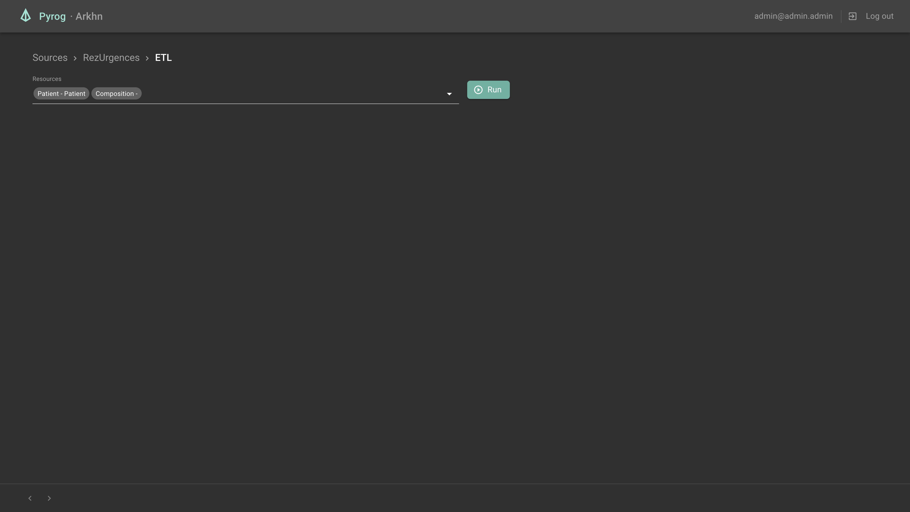

# App
## Generate API Routes
```shell
yarn generate:api
```

## Style guide
This React-Redux project follows the overall [Redux style guide](https://redux.js.org/style-guide/style-guide) recommended patterns

### Structure Files as Feature Folders with Single-File Logic
```
    .
    /src
    ├── index.tsx                       # Entry point file that renders the React component tree
    ├── /app
    │   ├── store.ts                    # store setup
    │   ├── App.tsx                     # root React component
    │   └── /routes                     # router and layout folders
    │       ├── Router.tsx              # Router component
    │       ├── Sources.tsx             # root Page component
    │       └── /resources
    │           └── Resources.tsx
    ├── /common                         # hooks, generic components, utils, etc
    ├── /features                       # contains all "feature folders"
    │   └── /todos                      # a single feature folder
    │       ├── todoSlice.ts            # Redux reducer logic and associated actions
    │       └── Todo.tsx                # a React component
    ├── /locales                        # i18n configuration
    ├── /services                       # contains the external called services
    │   └── /api                        # main api folder
    │       ├── /generated              # contains the generated rtk-query file with hooks (read only)
    │       │   └── api.generated.ts
    │       ├── api.ts                  # contains the enhanced endpoints
    │       └── apiBaseQuery.ts         # contains fetch configuration
```
* `/app` contains app-wide setup and layout that depends on all the other folders.
    * `/routes` contains the router component, and the layout folders which follow the routes tree
* `/common` contains truly generic and reusable utilities and components.
* `/features` has folders that contain all functionality related to a specific feature.
  In this example, todosSlice.ts is a "duck"-style file that contains a call to
  RTK's createSlice() function, and exports the slice reducer and action creators. Those folders
  shouldn't be deeply nested.

### Testing guiding principles
[The more your tests resemble the way your software is used, the more confidence they can give you.](https://testing-library.com/docs/guiding-principles)


# App Dependencies


## [Redux ToolKit](https://redux-toolkit.js.org/)
`Redux ToolKit` is a package used to handle the whole application state. Its module [RTK-Query](https://redux-toolkit.js.org/rtk-query/overview) is also used to handle API calls.
We made the choice of handling the state in 2 different ways : 


### - Using `RTK-Query`'s cached requests responses
The whole API schema is automatically generated by `tox` python module. This allows us to generate all the available API routes with [rtk-query-codegen](https://github.com/rtk-incubator/rtk-query-codegen) and thus it gives us access to a whole load of `Hooks` used to request data. Those hooks are wired to a redux `store` under the hood and the whole cache system is handled by `RTK-Query` itself.

To summarize, all the data displayed in the App comes from those `hooks`.


### - Using local `slices` (`Redux ToolKit`'s store system)
Basically, a `slice` is a store created with `Redux ToolKit`'s API. It handles nicely the actions/thunks/reducers logic.
In this project, when needed, a `slice` is created for each model class in need (ie `columnSlice`, `joinSlice`, ...). Those slices usually expose actions with basic purposes like adding an object or deleting one.

The main reason that made us use those `slices` on top of `RTK-Query`'s API store is to handle back-end objects creations/updates locally before applying the changes in the back-end. The best example use would be the whole mapping editing process : Before applying the changes made, we need to edit locally a whole load of class instances locally (columns, joins, filters, ...). 


## [Material-UI](https://material-ui.com/)

`Material-UI` is a React UI components library that follows the `Material Design` pattern. We use this library for our whole application UI.


## [Blueprint](https://blueprintjs.com/docs/)

`Blueprint` is another React UI components library. In our case, we only use this library for its icons.


## [I18next](https://www.i18next.com/)

`I18next` is an internationalization-framework used to translate our application in several languages. For now, there is only an English translation available.


## [ahryman40k/ts-fhir-types](https://www.npmjs.com/package/@ahryman40k/ts-fhir-types)

This typescript package lets us manage and handle FHIR R4 object models in our application.


# Codebase Logic

## Routes

Routes source code is located in folder `src/routes/`


### Sources


- URL: `/` or `/sources`
- Features:
  - [Sources](#sources)


### SourceMappings


- URL: `/sources/:sourceId`
- Features: 
  - [Sources](#sources)
  - [Mappings](#mappings)
  - [NavBar](#navBar)


### Batches


- URL: `/sources/:sourceId/batches`
- Features:
  - [Batches](#batches)
  - [NavBar](#navBar)


### CreateMapping


- URL: `/sources/:sourceId/batches`
- Features:
  - [Columns](#columns)
  - [Filters](#filters)
  - [Joins](#joins)
  - [Mappings](#mappings)


### Mapping


- URL: `/sources/:sourceId/mappings/:mappingId`
- Features:
  - [FhirAttributePanel](#fhirAttributePanel)
  - [FhirResourceTree](#fhirResourceTree)
  - [Conditions](#conditions)
  - [Scripts](#scripts)
  - [Columns](#columns)
  - [Joins](#joins)


### EditMapping


- URL: `/sources/:sourceId/mappings/:mappingId/edit`
- Features: 
  - [Columns](#columns)
  - [Filters](#filters)
  - [Joins](#joins)
  - [Mappings](#mappings)


### Preview


- URL: `/sources/:sourceId/mappings/:mappingId/preview` or `/sources/:sourceId/mappings/:mappingId/attributes/:attributeId/preview`
- Features:
  - [Mappings](#mappings)
  - [NavBar](#navBar)